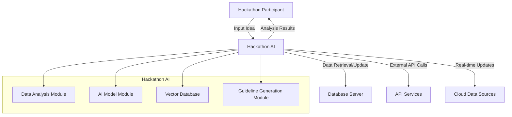

[](https://github.com/susumutomita/Hackathon-AI/actions/workflows/ci.yml)


# Hackathon AI - Hackathon Success Support Tool

## Overview

**Hackathon AI** is an AI-driven tool designed to help participants maximize their chances of success in hackathons by leveraging data from past events. Developed using TypeScript and Next.js, this web-based application provides insights to optimize project strategies by analyzing historical hackathon data.

## Key Features

- Analysis of Past Hackathon Data: Analyze trends from finalist projects and requirements from prize-winning projects to identify key success factors.
- Search for Similar Projects: Check the novelty of ideas and estimate the likelihood of success.
- Idea Refinement Using LLM: Utilize a Language Learning Model (LLM) to refine and improve ideas based on similar past projects.
- Trend Analysis and Prediction: Predict technological trends and identify project categories most likely to succeed.
- Strategic Guidelines: Provide guidelines for optimizing presentations, team building, and analyzing judging criteria.

## System Architecture

This project is built using TypeScript and Next.js . Below is an overview of the system architecture.

### System Context Diagram



### Architecture Overview

- Hackathon Participant: The user who utilizes Hackathon AI to gain insights based on past data.
- Hackathon AI: A web application integrating data analysis, AI models, a vector database, and guideline generation modules.
- Database Server: Manages and stores data from past hackathons and projects.

## Installation and Setup

### Prerequisites

- Node.js (version 14.x or above)
- pnpm
- Ollama (for running the LLM locally)

### Installation Steps

1. Clone the repository:

    ```bash
    git clone https://github.com/susumutomita/Hackathon-AI
    ```

2. Install dependencies:

    ```bash
    make install
    ```

3. Start the application in development mode:

    ```bash
    make dev
    ```

4. To create a production build:

    ```bash
    make build
    ```

### Manual Execution of the Crawler

To manually run the crawler after setting up your development environment or starting the server, use the following command:

```bash
curl http://localhost:3000/api/crawl
```

## Usage

1. After launching the application, input your idea through the user interface.
2. Hackathon AI will search for similar projects and display the results.
3. Based on these results, the LLM will provide improvement suggestions for your idea in Japanese.
4. Use these suggestions to further refine your project and enhance your chances of success in the hackathon.

## Development Environment

- TypeScript: Used as the primary programming language.
- Next.js: Provides an easy-to-use platform for building the web application.
- React: Used to create UI components.
- Qdrant: A vector database used for searching similar projects.
- Ollama: A local LLM tool used to analyze ideas and generate improvement suggestions.

## License

This project is licensed under the MIT License. See the [LICENSE](LICENSE) file for details.
