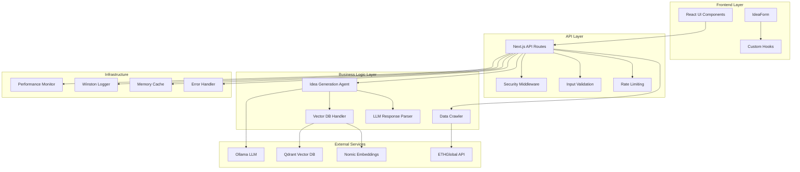
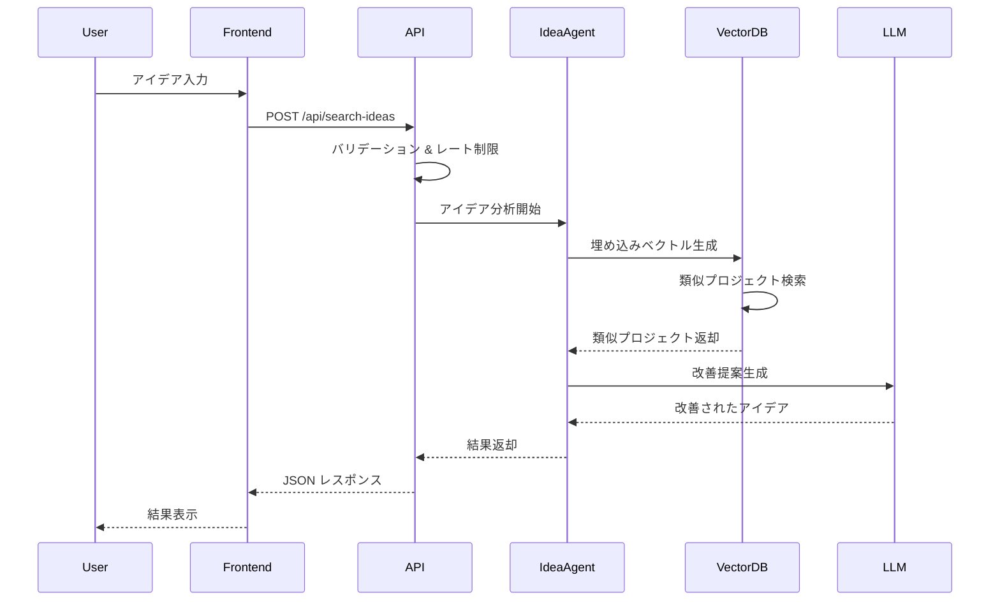

# Hackathon AI - アーキテクチャドキュメント

## システム概要

Hackathon AI は、過去のハッカソンデータを活用してアイデアの改善と成功確率向上を支援する Web アプリケーションです。Next.js フレームワークをベースとし、AI/メーリングリスト技術とベクトルデータベースを組み合わせた現代的なアーキテクチャを採用しています。

## アーキテクチャ図

### システム全体図



### データフロー図



## 技術スタック

### フロントエンド
- React 18: UI ライブラリ
- Next.js 15: フルスタックフレームワーク
- TypeScript: 型安全な開発
- Tailwind CSS: スタイリング
- Radix UI: アクセシブルな UI コンポーネント
- Lucide React: アイコンライブラリ

### バックエンド
- Next.js API Routes: サーバーサイド API
- Node.js: サーバーランタイム
- TypeScript: 型安全な開発

### AI/メーリングリスト スタック
- Ollama: ローカル LLM 実行環境
- Nomic AI: 埋め込みベクトル生成
- Qdrant: ベクトルデータベース

### データ処理
- Cheerio: HTML パーシング
- Axios: HTTP クライアント

### 開発・品質管理
- Vitest: テスティングフレームワーク
- ESLint: 静的解析
- Prettier: コードフォーマッター
- Husky: Git フック管理
- PNPM: パッケージマネージャー

### 監視・ログ
- Winston: ログ管理
- カスタムパフォーマンス監視: メトリクス収集

## レイヤー別詳細設計

### 1. プレゼンテーション層 (Frontend)

#### コンポーネント構造
```
src/components/
├── ui/                    # 基本UIコンポーネント
│   ├── button.tsx
│   ├── input.tsx
│   ├── card.tsx
│   └── ...
├── IdeaForm.tsx          # メインフォーム
├── LazyIdeaForm.tsx      # 遅延読み込み対応
└── ErrorBoundary.tsx     # エラー境界
```

#### 状態管理
- React Hooks: ローカル状態管理
- Custom Hooks: ビジネスロジックの抽象化
  - `useCSRF`: CSRF トークン管理
  - `useFormValidation`: フォームバリデーション

### 2. API層

#### エンドポイント設計
```
src/pages/api/
├── generate-idea.ts      # アイデア生成
├── search-ideas.ts       # 類似プロジェクト検索
├── improve-idea.ts       # アイデア改善
├── crawl.ts             # データクローリング
├── auto-crawl.ts        # 自動クローリング
├── update-events.ts     # イベント更新
└── csrf-token.ts        # CSRF トークン
```

#### ミドルウェア
- セキュリティミドルウェア: CORS、ヘッダー設定
- レート制限: IP ベースの制限
- バリデーション: Zod スキーマによる入力検証
- エラーハンドリング: 統一されたエラー処理

### 3. ビジネスロジック層

#### 主要コンポーネント

##### IdeaAgent (`src/lib/ideaAgent.ts`)
- アイデア生成・改善のメインロジック
- LLM との連携
- プロンプトエンジニアリング

##### QdrantHandler (`src/lib/qdrantHandler.ts`)
- ベクトルデータベース操作
- 埋め込みベクトル生成
- 類似プロジェクト検索
- キャッシュ機能

##### Crawler (`src/lib/crawler.ts`)
- ETHGlobal ショーケースからのデータ収集
- HTML パーシング
- データ正規化

### 4. データ層

#### ベクトルデータベース (Qdrant)
```
Collection: hackathon_projects
├── id: string
├── vector: float[768]    # Nomic embeddings
└── payload:
    ├── title: string
    ├── description: string
    ├── tags: string[]
    ├── hackathon: string
    └── prize: string
```

#### キャッシュ戦略
- In-Memory Cache: 埋め込みベクトル
- TTL: 1 時間
- LRU eviction: メモリ効率化

## セキュリティ設計

### 1. 入力検証
- Zod スキーマ: 型安全なバリデーション
- DOMPurify: XSS 攻撃対策
- 文字列サニタイゼーション: SQL インジェクション対策

### 2. レート制限
```typescript
// 制限レベル
const RATE_LIMITS = {
  API: 10,        // 1分間に10リクエスト
  SEARCH: 5,      // 1分間に5リクエスト
  CRAWL: 1        // 1分間に1リクエスト
};
```

### 3. CORS設定
- 開発環境: すべてのオリジンを許可
- 本番環境: 特定ドメインのみ許可（推奨）

### 4. 環境変数管理
```
QD_URL=              # Qdrant エンドポイント
QD_API_KEY=          # Qdrant API キー
NOMIC_API_KEY=       # Nomic AI API キー
OLLAMA_BASE_URL=     # Ollama エンドポイント
```

## パフォーマンス最適化

### 1. フロントエンド最適化
- Code Splitting: 動的インポート
- Lazy Loading: コンポーネント遅延読み込み
- Memoization: 重い計算のキャッシュ

### 2. バックエンド最適化
- ベクトルキャッシュ: 埋め込み計算の削減
- 接続プーリング: データベース接続効率化
- 非同期処理: I/O 操作の並列化

### 3. 監視指標
```typescript
interface PerformanceMetrics {
  apiResponseTime: number;     // API応答時間
  vectorSearchTime: number;    // ベクトル検索時間
  embeddingTime: number;       // 埋め込み生成時間
  cacheHitRate: number;        // キャッシュヒット率
  totalRequestTime: number;    // 総リクエスト時間
}
```

## エラーハンドリング戦略

### 1. エラー分類
```typescript
enum ErrorType {
  VALIDATION_ERROR = 'VALIDATION_ERROR',
  AUTHENTICATION_ERROR = 'AUTHENTICATION_ERROR',
  AUTHORIZATION_ERROR = 'AUTHORIZATION_ERROR',
  RATE_LIMIT_ERROR = 'RATE_LIMIT_ERROR',
  TIMEOUT_ERROR = 'TIMEOUT_ERROR',
  EXTERNAL_SERVICE_ERROR = 'EXTERNAL_SERVICE_ERROR',
  INTERNAL_SERVER_ERROR = 'INTERNAL_SERVER_ERROR'
}
```

### 2. エラー応答形式
```typescript
interface ApiErrorResponse {
  error: string;
  message: string;
  details?: string;
  suggestions?: string[];
  timestamp: string;
  requestId?: string;
}
```

### 3. 復旧戦略
- Retry Logic: 一時的な障害への対応
- Circuit Breaker: 外部サービス障害時の保護
- Graceful Degradation: 機能縮退での継続運用

## スケーラビリティ設計

### 1. 水平スケーリング対応
- ステートレス設計: セッション情報の外部化
- ロードバランサー: 複数インスタンス間での負荷分散
- マイクロサービス化: 機能別サービス分割（将来計画）

### 2. データベーススケーリング
- Qdrant クラスター: 分散ベクトル検索
- レプリケーション: 読み取り性能向上
- シャーディング: 大規模データ対応

### 3. キャッシュ戦略
- Redis 導入: 分散キャッシュ（将来計画）
- CDN 活用: 静的アセット配信
- Browser Cache: クライアントサイドキャッシュ

## デプロイメント戦略

### 1. 環境構成
- Development: ローカル開発環境
- Staging: 本番類似環境での検証
- Production: 本番環境

### 2. CI/CD パイプライン
```yaml
# GitHub Actions ワークフロー
name: CI/CD Pipeline
on: [push, pull_request]
jobs:
  test:
    - Lint & Format Check
    - Type Check
    - Unit Tests
    - Integration Tests
  build:
    - Next.js Build
    - Docker Image Build
  deploy:
    - Staging Deployment
    - E2E Tests
    - Production Deployment
```

### 3. 監視・アラート
- ヘルスチェック: `/api/health` エンドポイント
- メトリクス収集: パフォーマンス指標
- ログ集約: 中央ログ管理
- アラート: 閾値ベースの通知

## 今後の技術的発展

### 1. 短期計画（3-6ヶ月）
- テストカバレッジ向上: 90％以上を目標
- パフォーマンス最適化: 応答時間 50％短縮
- セキュリティ強化: 認証・認可機能追加

### 2. 中期計画（6-12ヶ月）
- マイクロサービス化: 機能別サービス分割
- リアルタイム機能: WebSocket 導入
- 高度な分析: 機械学習モデル強化

### 3. 長期計画（1-2年）
- 多言語対応: 国際化対応
- モバイルアプリ: React Native 導入
- AI 自動化: 完全自動化されたアイデア生成

## トラブルシューティング

### 1. 一般的な問題
- API タイムアウト: Ollama サービス再起動
- ベクトル検索エラー: Qdrant 接続確認
- 埋め込み生成失敗: Nomic API キー確認

### 2. 監視ポイント
- 応答時間: 95％ile < 2 秒
- エラー率: < 1%
- 可用性: > 99.9%
- メモリ使用量: < 80%

### 3. ログ解析
```bash
# エラーログ検索
grep "ERROR" logs/app.log | tail -100

# パフォーマンスログ分析
grep "Performance" logs/app.log | grep "duration:" | awk '{print $NF}'
```

このアーキテクチャは、スケーラビリティ、保守性、セキュリティを重視した設計となっており、継続的な改善とモニタリングを通じて高品質なサービス提供を実現しています。